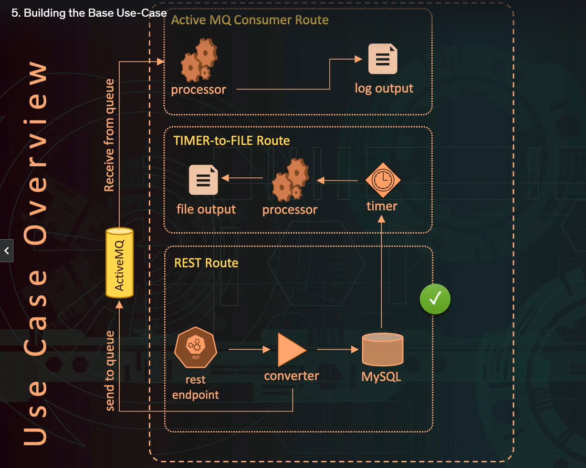

# Demonstration advanced-apache-camel

This demonstration application show how to design and develop Entreprise integration application, or pipeline application that use  Entreprise Service Bus.
We are going to use a lightweight called ESB Apache Camel.
Apache Camel performs the transformation, enrichment, aggregation and/or routing of messages between applications. 
It offers a (very) wide range of connectors in order to be able to interface with many protocols and/or technologies.

## The use case
Application that expose rest web services on http endpoint to manage personal address data.
* Rest api for CRUD operation on Mysql Data base
* Scheduling Batch that exports addresses data into file 
* Export into AMQ queue

The application
* Exposes http endpoint on 8080 port
* Can accept Rest post messages with a name and address information and store these messages in a database.
* HandleS a timer that
    * Uses JPA native equities to retrieve that information,
    * Process that information
    * Write that information into a file output.
    * Write message to active MQ QUEUE.

This file output or Active MQ queue can then be transferred to a destination application.

## Project creation
The Camel environment, or CamelContext, is a Spring bean that can be declared in the container of your choice: web, ejb, spring boot, eclipse RCP, batches......
### Technologies:
* Maven 3
* Java 11
* Spring boot 2.6.3
* hibernate 5
* Mysql 8 
* org.projectlombok ( enrich java entity by auto-generating Java bytecode )

### Maven dependencies
*  spring-boot-starter-parent: Parent pom providing dependency and plugin management for applications built with spring boot.
   Once we’ve declared the starter parent in our project, we can pull any dependency from the parent by just declaring it in our dependencies tag.
   *  spring-boot-starter-test: Spring Boot provides a number of utilities and annotations to help when testing your application.
   *  camel-spring-boot-starter:
        *  camel-beanio-starter:Camel support for Spring Boot provides auto-configuration of the Camel and starters for many Camel components. Our opinionated auto-configuration of the Camel context auto-detects Camel routes available in the Spring context and registers the key Camel utilities (like producer template, consumer template and the type converter) as beans.
        *  camel-rest-starter: Expose REST services or call external REST services.
        *  camel-jetty-starter: Expose HTTP endpoints using Jetty 12.    
        *  camel-jackson-starter: Marshal POJOs to JSON and back using Jackson.
        *  camel-jpa-starter: Store and retrieve Java objects from databases using Java Persistence API (JPA).
        *  camel-activemq-starter: Send messages to (or consume from) Apache ActiveMQ 5.x. This component extends the Camel JMS component.
        *  camel-controlbus-starter: Manage and monitor Camel routes.
    * hibernate-entitymanager: EntityManager is part of the Java Persistence API
    * mysql-connector-java: MySQL Connector/J is the official JDBC driver for MySQL. MySQL Connector/J 8.0 and higher is compatible with all MySQL versions starting with MySQL 5.7.
    * lombok: Lombok is a Java library that provides annotations to simplify Java development by automating the generation of boilerplate code.